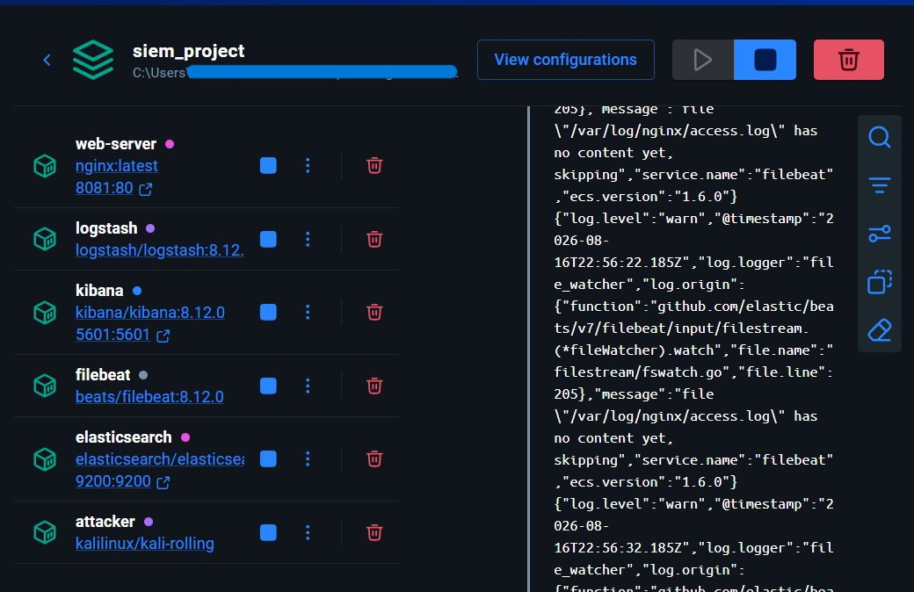
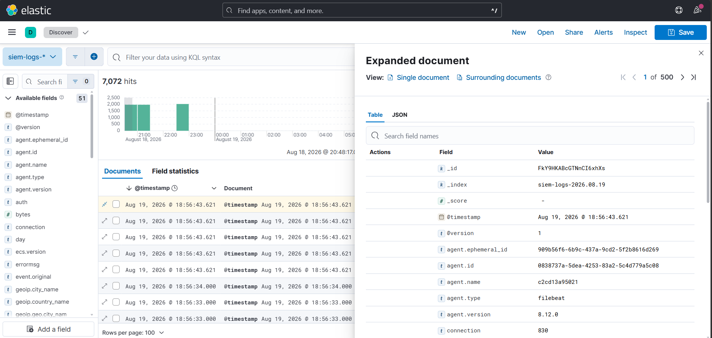
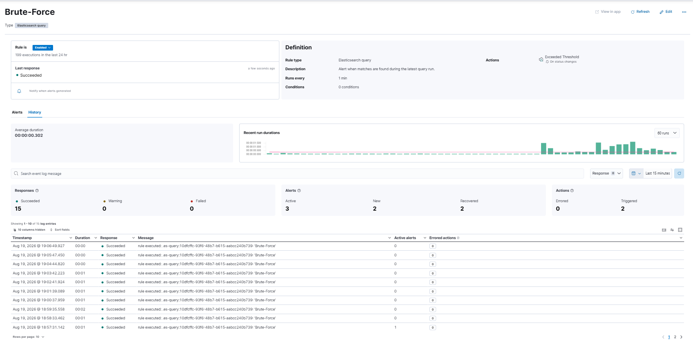
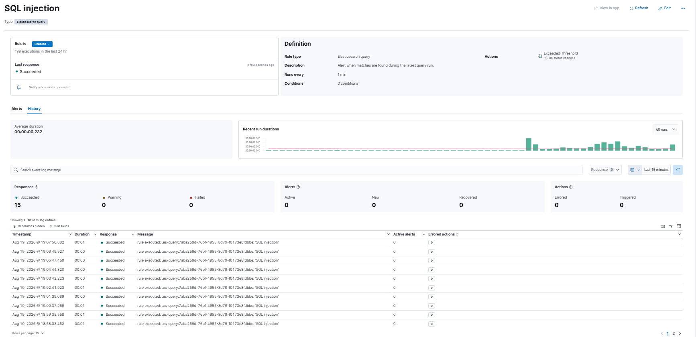

# Containerized SIEM & Detection Pipeline

A self-contained Security Information and Event Management (SIEM) lab built on the Elastic Stack (Elasticsearch, Logstash, Kibana) and Filebeat, running under Docker Compose with resource-constrained containers, custom log parsing, a threat-simulation script, and detection rules mapped to MITRE ATT&CK.

This is a project overview. Consult the "StepByStep.md" file, in the folder, for more details. 

---

## Architecture

```
[ Nginx Web Server ] ---> [ Filebeat ] ---> [ Logstash ] ---> [ Elasticsearch ] <---> [ Kibana ]
  (log source)          (log shipper)    (Grok parsing,        (index store)      (dashboards &
                                           GeoIP enrich)                            alert rules)
```

Attack traffic (`run_attacks.sh`) is generated from inside the `attacker` container and reaches the target through the `web-server` service name on the Docker network. That keeps the simulation aligned with the container layout defined in `docker-compose.yml`.

The active Compose file does not mount `default.conf` or `nginx/default.conf` into the `web-server` container. NGINX therefore starts with the configuration provided by the `nginx:latest` image; `run_attacks.sh` adds an authentication configuration inside the running container for its brute-force simulation.

## Repository Structure

```
├── docker-compose.yml       # Service orchestration, JVM heap limits, container networks
├── filebeat.yml              # Filestream harvester config & Logstash output target
├── logstash.conf             # Beats input → Grok filter → GeoIP → Elasticsearch output
├── siem-template.json        # Elasticsearch index mapping template
├── run_attacks.sh            # Threat simulation script (brute force, SQLi, XSS, traversal, scanners)
├── nginx/default.conf        # Reference NGINX config; not mounted by the active Compose file
├── .env.example               # Placeholder for Kibana saved-object encryption keys
├── docs/
│   └── screenshots/          # Verified execution evidence
└── README.md
```

## Detection Coverage & MITRE ATT&CK Mapping

| Threat Vector | Query Logic / Field Matching | Trigger Condition | MITRE ATT&CK Technique |
|---|---|---|---|
| HTTP Brute Force | `http.response.status_code:(401 OR 403)` | > 5 matches / 5 min | T1110 — Brute Force |
| SQL Injection | `url.original:(*DROP* OR *UNION* OR *SELECT* OR *OR*)` | > 5 matches / 5 min | T1190 — Exploit Public-Facing App |
| Path Traversal | `url.original:(*../* OR *..\\* OR *%2e%2e*)` | > 5 matches / 5 min | T1083 — File & Directory Discovery |
| Reconnaissance Tooling | `user_agent.original:(*sqlmap* OR *nikto* OR *nmap* OR *metasploit*)` | > 1 match / 5 min | T1595 — Active Scanning |
| Volumetric Anomaly | `http.response.status_code: >= 400` | > 10 matches / 5 min | T1498 — Network Denial of Service |

## Setup & Deployment

### Prerequisites
- Docker Engine v20.10+ and Docker Compose v2.0+
- Minimum 8 GB host RAM (containers run under strict memory caps)

### 1. Environment Initialization

```bash
# Generate the Kibana saved-object encryption keys and create your local .env
cp .env.example .env
# then populate XPACK_ENCRYPTEDSAVEDOBJECTS_ENCRYPTIONKEY, XPACK_SECURITY_ENCRYPTIONKEY,
# and XPACK_REPORTING_ENCRYPTIONKEY with 32+ byte random strings, e.g.:
openssl rand -base64 32

docker compose up -d
```

`.env` is listed in `.gitignore` and is never committed — only `.env.example` (with placeholder values) ships in this repo.

### 2. Verify Container Status

```bash
docker compose ps
```

All services (`elasticsearch`, `logstash`, `kibana`, `filebeat`, `web-server`, `attacker`) should show `Up`. The Compose file does not define Docker healthchecks or `service_healthy` dependencies, so this is a container-status check only.



### 3. Access Interfaces

| Service | URL |
|---|---|
| Elasticsearch | http://localhost:9200 |
| Kibana | http://localhost:5601 |
| Web server (attack target) | http://localhost:8081 |

## Running the Threat Simulation

The repository contains two attack scripts. `run_attacks.sh` sends an `X-Forwarded-For` header using rotating public IP values for the GeoIP demonstration. `additional_attacks.sh` does not spoof that header; it generates additional probes and includes a separate header-injection test.


```bash
bash run_attacks.sh
```

This script:
- Configures HTTP Basic Auth on the target site, then throws 200 bad-credential requests at it from inside the `attacker` container (brute force)
- Fires 150 path-traversal attempts (`../../../etc/passwd` and encoded variants)
- Sends 150 SQL injection payloads across common patterns (`OR '1'='1`, `UNION SELECT`, `DROP TABLE`, etc.)
- Sends 130 XSS payloads (`<script>`, `<svg onload>`, ``)
- Sends 130 requests using known scanner user-agents (`sqlmap`, `nikto`, `nmap`, `metasploit`)
- Sends 120 large (500 KB) POST bodies to simulate a volumetric anomaly

**Run only in isolated lab environments.** Review the script before executing it.

## Verification & Investigation

### Log ingestion

In Kibana Discover (`siem-logs-*`), incoming events are parsed into ECS-style structured fields including `source.address`, `http.request.method`, `http.response.status_code`, `url.original`, and `user_agent.original`, with GeoIP location enrichment applied where a client IP is present:



### Alerting

Detection rules run on a 5-minute evaluation window under **Stack Management → Rules and Alerts**. Alert status flips to **Active**/**Flapping** when a threshold is breached — this is a live brute-force rule catching the simulated credential-stuffing traffic:





## Engineering Considerations & Trade-Offs

- **JVM heap limits.** Elasticsearch and Logstash heaps are capped (`-Xms512m -Xmx512m` and `-Xms256m -Xmx256m` respectively) alongside a `mem_limit: 1g` Docker constraint, to keep the stack runnable on an 8 GB host without OOM kills during ingestion spikes.
- **Grok failure handling.** Nginx error-log lines that don't match the expected pattern are tagged `grok_failed` rather than dropped, so malformed events stay visible in the index instead of silently disappearing.
- **Alert tuning.** Detection rules evaluate over a 5-minute window to filter out one-off noise from transient network blips while still catching sustained, automated attack patterns.

## Known Limitations & Next Steps

The main follow-up work for the lab is now complete, but a few areas are still intentionally lightweight:

- **`logstash.conf` still relies on `%{COMBINEDAPACHELOG}` for the initial parse.** The ECS rename block makes the resulting documents easier to query, but the grok stage itself remains a pragmatic shortcut for this lab.
- **`siem-template.json` only maps the fields the lab currently uses.** If you add more detectors or enrichments, expand the template alongside them.

## Security & Ethics

This lab generates real (if scoped) attack traffic against a container on your own machine. Only run `run_attacks.sh` inside this isolated Docker network — never against a system or network you don't own or have explicit authorization to test.

## License

MIT License — provided for educational and demonstration purposes.


https://github.com/user-attachments/assets/8d18f333-fa1f-4b39-be90-44d914bf0e18


