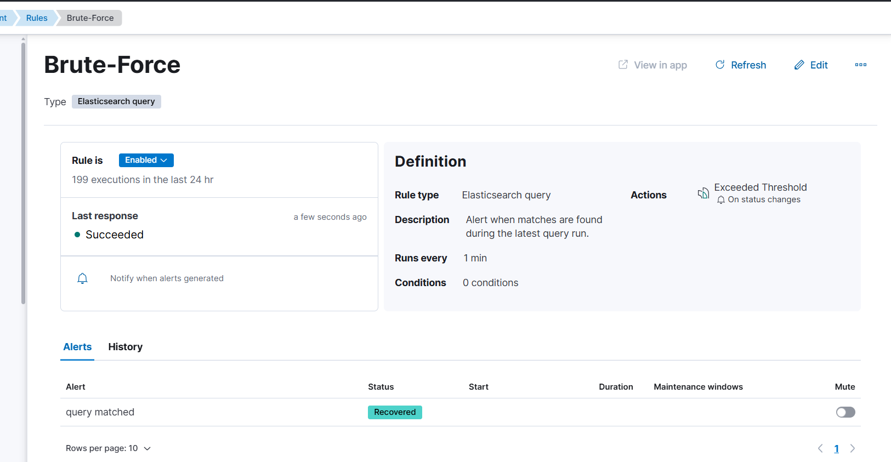
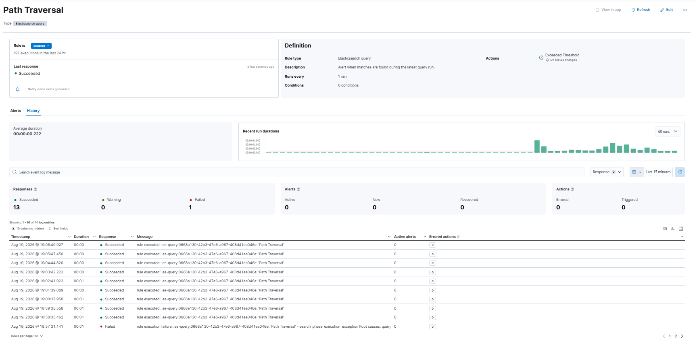
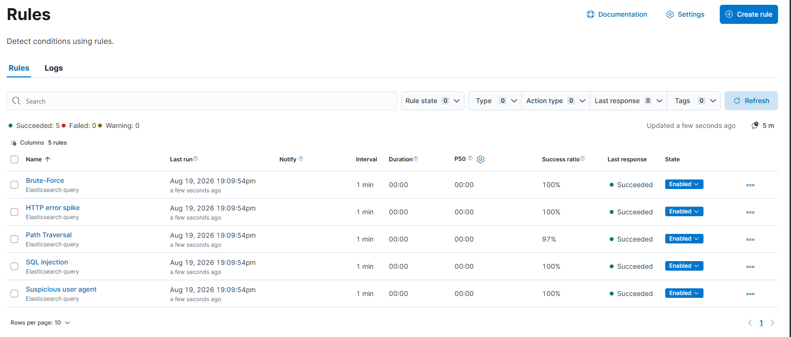
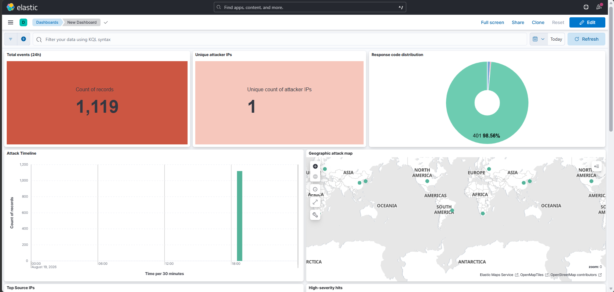
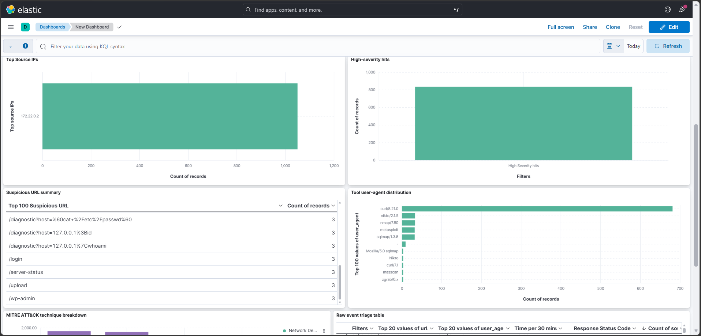
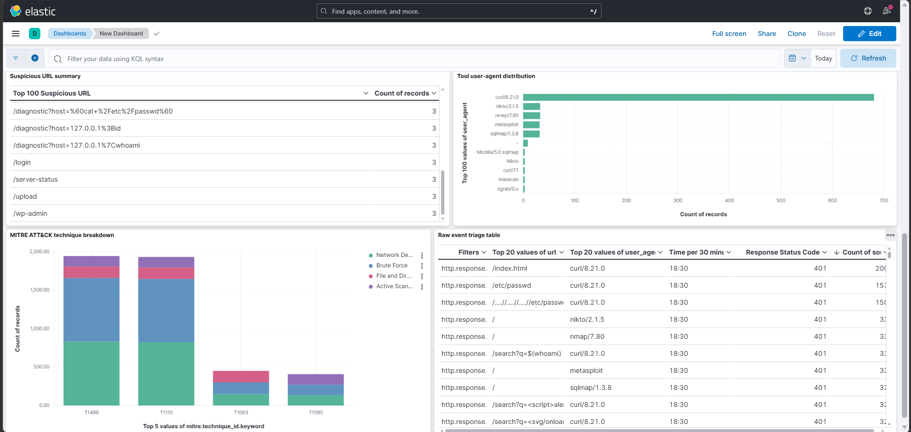

# Containerized SIEM & Detection Pipeline

A self-contained Security Information and Event Management (SIEM) lab built on the Elastic Stack (Elasticsearch, Logstash, Kibana) and Filebeat, running under Docker Compose with resource-constrained containers, custom log parsing, a threat-simulation script, and detection rules mapped to MITRE ATT&CK.

---

## Architecture

```
[ Nginx Web Server ] ---> [ Filebeat ] ---> [ Logstash ] ---> [ Elasticsearch ] <---> [ Kibana ]
  (log source)          (log shipper)    (Grok parsing,        (index store)      (dashboards &
                                           GeoIP enrich)                            alert rules)
```

Attack traffic (`run_attacks.sh`) is generated from inside the `attacker` container and reaches the target through the `web-server` service name on the Docker network. That keeps the simulation aligned with the container layout defined in `docker-compose.yml`.

## Repository Structure

```
├── docker-compose.yml       # Service orchestration, JVM heap limits, container networks, health checks
├── filebeat.yml              # Filestream harvester config & Logstash output target
├── logstash.conf             # Beats input → Grok filter → GeoIP → MITRE tagging → Elasticsearch output
├── siem-template.json        # Elasticsearch index mapping template
├── run_attacks.sh            # Core threat simulation (brute force, SQLi, XSS, traversal, scanners)
├── additional_attacks.sh     # Supplementary probes (header injection, method fuzzing, admin endpoints, auth anomalies)
├── nginx/default.conf        # Custom log_format (incl. X-Forwarded-For) + site config, mounted into web-server
├── .env.example               # Placeholder for Kibana saved-object encryption keys
├── docs/
│   └── screenshots/          # Verified execution evidence
└── README.md
```

## Detection Coverage & MITRE ATT&CK Mapping

| Threat Vector | Query Logic / Field Matching | Trigger Condition | MITRE ATT&CK Technique |
|---|---|---|---|
| HTTP Brute Force | `http.response.status_code:(401 OR 403)` | > 5 matches / 5 min | T1110 — Brute Force |
| SQL Injection | `url.original:(*DROP* OR *UNION* OR *SELECT* OR *OR*)` | > 5 matches / 5 min | T1190 — Exploit Public-Facing App |
| Path Traversal | `url.original:(*../* OR *..\\* OR *%2e%2e*)` | > 5 matches / 5 min | T1083 — File & Directory Discovery |
| Reconnaissance Tooling | `user_agent.original:(*sqlmap* OR *nikto* OR *nmap* OR *metasploit*)` | > 1 match / 5 min | T1595 — Active Scanning |
| Volumetric Anomaly | `http.response.status_code: >= 400` | > 10 matches / 5 min | T1498 — Network Denial of Service |

Every event matching one of these patterns is also tagged at the individual event level with `mitre.technique_id`/`mitre.technique_name` in `logstash.conf` — independent of whether the 5-minute threshold above has been crossed. This powers the dashboard's MITRE ATT&CK breakdown panel; the alert rules above are the actionable, threshold-based signal, the tagging is the descriptive, per-event signal. A single event can carry more than one technique tag.

## Setup & Deployment

### Prerequisites
- Docker Engine v20.10+ and Docker Compose v2.0+
- Minimum 8 GB host RAM (containers run under strict memory caps)

### 1. Environment Initialization

```bash
# Generate the Kibana saved-object encryption keys and create your local .env
cp .env.example .env
# then populate XPACK_ENCRYPTEDSAVEDOBJECTS_ENCRYPTIONKEY, XPACK_SECURITY_ENCRYPTIONKEY,
# and XPACK_REPORTING_ENCRYPTIONKEY with 32+ byte random strings, e.g.:
openssl rand -base64 32

docker compose up -d
```

`.env` is listed in `.gitignore` and is never committed — only `.env.example` (with placeholder values) ships in this repo.

### 2. Verify Container Health

```bash
docker compose ps
```

All services (`elasticsearch`, `logstash`, `kibana`, `filebeat`, `web-server`, `attacker`) should show `Up`.


### 3. Access Interfaces

| Service | URL |
|---|---|
| Elasticsearch | http://localhost:9200 |
| Kibana | http://localhost:5601 |
| Web server (attack target) | http://localhost:8081 |

## Running the Threat Simulation

```bash
bash run_attacks.sh
```

This script:
- Configures HTTP Basic Auth on the target site, then throws 200 bad-credential requests at it from inside the `attacker` container (brute force)
- Fires 150 path-traversal attempts (`../../../etc/passwd` and encoded variants)
- Sends 150 SQL injection payloads across common patterns (`OR '1'='1`, `UNION SELECT`, `DROP TABLE`, etc.)
- Sends 130 XSS payloads (`<script>`, `<svg onload>`, ``)
- Sends 130 requests using known scanner user-agents (`sqlmap`, `nikto`, `nmap`, `metasploit`)
- Sends 120 large (500 KB) POST bodies to simulate a volumetric anomaly

**Run only in isolated lab environments.** Review the script before executing it.

A second script, `additional_attacks.sh`, adds supplementary coverage: encoded path-traversal variants, command-injection query parameters, HTTP header injection probes, unusual HTTP methods (`TRACE`, `CONNECT`, etc.), common admin/config endpoint probing (`/wp-admin`, `/server-status`, `/.env`), and multi-credential authentication anomalies. It follows the same in-container execution pattern as `run_attacks.sh`:

```bash
bash additional_attacks.sh
```

### GeoIP note

Attack traffic in this lab originates from the internal Docker network (private IPs, which MaxMind cannot geolocate). Both attack scripts spoof an `X-Forwarded-For` header using real public DNS-resolver IPs spread across several regions, so the dashboard's geographic map has real coordinates to plot. This mirrors a genuine production pattern — services behind a reverse proxy or load balancer must GeoIP the forwarded client IP, not the proxy's own address — but the specific IP-to-location mapping shown on the map is for demonstration, not real attacker telemetry.

## Verification & Investigation

### Log ingestion

In Kibana Discover (`siem-logs-*`), incoming events are parsed into ECS-style structured fields including `source.address`, `http.request.method`, `http.response.status_code`, `url.original`, and `user_agent.original`. Events with a resolved `network.geoip_source` (see the GeoIP note above) also carry `geoip.location`/`geoip.country_name`/`geoip.city_name`, and events matching a detection pattern carry `mitre.technique_id`/`mitre.technique_name`:


### Alerting

Detection rules run on a 5-minute evaluation window under **Stack Management → Rules and Alerts**. Alert status flips to **Active**/**Flapping** when a threshold is breached — this is a live brute-force rule catching the simulated credential-stuffing traffic:






All five rules running healthy, alongside their success ratio and last-run status:



## Dashboard

Beyond the five detection-coverage panels, the dashboard includes a KPI summary row (total events, unique attacker IPs, high-severity hit count), a clustered geographic attack map, a MITRE ATT&CK technique breakdown, and a raw-event triage table for drilling into specific requests:





## Engineering Considerations & Trade-Offs

- **JVM heap limits.** Elasticsearch and Logstash heaps are capped (`-Xms512m -Xmx512m` and `-Xms256m -Xmx256m` respectively) alongside a `mem_limit: 1g` Docker constraint, to keep the stack runnable on an 8 GB host without OOM kills during ingestion spikes.
- **Grok failure handling.** Nginx error-log lines that don't match the expected pattern are tagged `grok_failed` rather than dropped, so malformed events stay visible in the index instead of silently disappearing.
- **Alert tuning.** Detection rules evaluate over a 5-minute window to filter out one-off noise from transient network blips while still catching sustained, automated attack patterns.

## Known Limitations & Next Steps

- **Tool user-agent distribution panel has default-curl noise.** Every unlabeled request carries curl's own default UA string, which currently outweighs the deliberate scanner-signature traffic (`sqlmap`, `nikto`, `nmap`, `metasploit`) in raw count. A `NOT user_agent.original: curl*` filter on that panel fixes this; not yet applied to the saved dashboard.
- **Single-node, no security hardening.** `xpack.security.enabled=false` and a single-node Elasticsearch cluster are appropriate for a local lab but are not representative of a production deployment — there's no authentication on Elasticsearch/Kibana and no TLS between services.
- **`siem-template.json` only maps the fields the lab currently uses.** If you add more detectors or enrichments, expand the template alongside them.

## Security & Ethics

This lab generates real (if scoped) attack traffic against a container on your own machine. Only run `run_attacks.sh` inside this isolated Docker network — never against a system or network you don't own or have explicit authorization to test.

## License

MIT License — provided for educational and demonstration purposes.